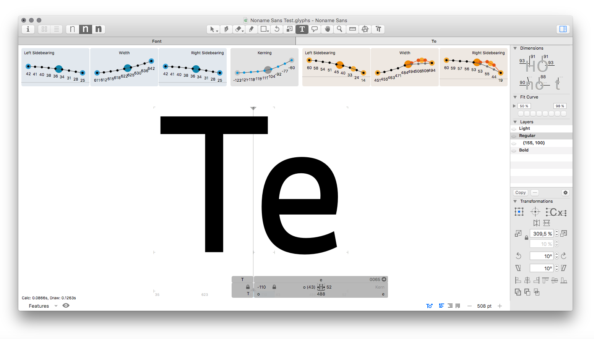

This repository hosts Yanone’s plug-in for [Glyphs.app](https://glyphsapp.com).

# Space Bar

Space Bar is a plug-in for the popular type design application Glyphs.app
that gives you a lot more insight into the spacing and other metrics of your font.
It is particularly handy for working on a font with multiple masters.

The tool visualizes metrics values that cannot otherwise be seen while editing.
Because you’re working on a master, you can’t see how your changes play out across all your defined instances.

More information here: [https://yanone.de/software/spacebar/](https://yanone.de/software/spacebar/)

# Installation

The plugins is installed through Glyphs.app’s built-in *Plugin Manager* .

# How To Use

### Glyphs.app

The plug-in is activated in the View menu under *Show Space Bar*.

# License

Formerly a commercial plug-in sold by Yanone, it is free & open source software as of March 2020 courtesy of Google Fonts, published under the **Apache 2.0** license.

# Contribution

If you want to see any changes in Space Bar, either make them yourselves and send me a pull request, or maybe contact me first.

# Version History

v1.11 (April 2021): Fixed kerning carshing in instance mode

v1.08 (April 2020): Fixed order and position of value display in the master view

v1.07 (March 2020): Re-released as open source

v1.06 (September 2019): Compatibility update for macOS Catalina
This plugin is notarized by Apple’s new security system for third-party software, which is necessary to run on macOS Catalina. Otherwise the plugin is identical to its previous version 1.05.

v1.05 (June 2018): Reaction to undocumented and unforeseeable API changes in Glyphs 2.5.1

v1.04 (April 2018): Fixed possible crash when no tab is open.

v1.03 (April 2018): Sped up Glyphs start.

v1.02 (December 2017): Reaction on API changes in Glyphs 2.4.4

v1.01 (June 2017): Reaction on API changes in Glyphs 2.4.2
This version of Space Bar is *not* backward-compatible with the stable Glyphs.app version 2.4.1, eventhough this should have been possible. It is intended for the latest Cutting Edge versions of 2.4.2 (at least build number 1035 as of this writing, maybe older ones, too) and will be compatible with the upcoming stable release of 2.4.2.

v1.0 (April 2017): Initial Release
